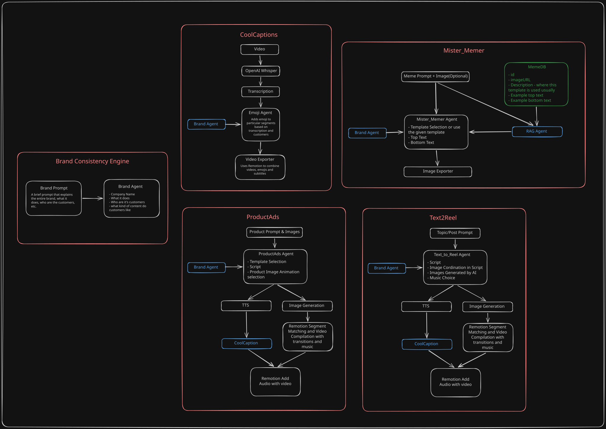
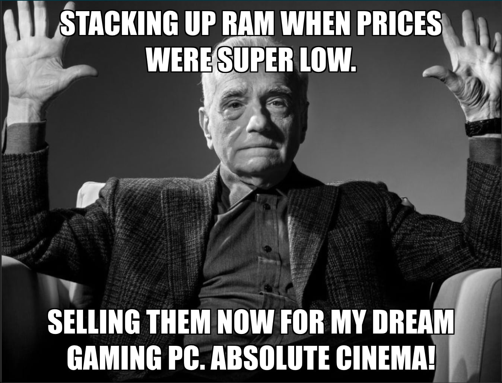

# AutoReelEngine
## Summary
AutoReelEngine is an AI content tool for startups and businesses that automatically creates engaging social media videos, product ads, and meme-style posts from text, images, or raw footage. It helps brands post more often, save time, and keep their online presence active without needing a full creative team.
## Main Features
The platform will support four content modes:
- **CoolCaptions:** takes a talking-head video and automatically generates captions, visual highlights, icons, cutaway suggestions, and emphasis points to make the video more engaging.
- **Text2Reel:** converts a text post, article, or script into a short reel by generating scene-by-scene visual direction, captions, and optional voiceover.
- **ProductAds:** uses uploaded product images or videos to generate high-conversion promotional reels with motion graphics, transitions, and brand-aligned messaging.
- **Mister_Memer:** creates brand-safe meme content tailored to the audience’s tone and engagement style to support frequent, low-effort posting.
## Architecture

## Demo
**CoolCaptions:**
- Uses OpenAI whishper to transcribe the video and generate srt file
- Uses Remotion to add captions with appropiate animations
- Gives user the ability to change position, font, font-size
- Adds relevant emoji using an agent created with PydanticAI library and gemini
- Adds B-Roll footages using Gemini and Pexels API

https://github.com/user-attachments/assets/0eb57b7a-bd04-4fb1-baa8-4a0c7831e848

**Text2Reel**
- Uses PydanticAI and Gemini API to generate script, tone, visual prompts
- Uses Brand Consistency Agent to find all necessary details about the brand
- Supports two languages: Bangla and English
- Uses EdgeTTS to generate to generate the audio file
- Gives user the ability to edit script, visual prompts
- Fetches Videos from Pexels API based on the visual prompts
- Automatically selects background music based on tone

| Example Output(English) | Example Output(Bangla) |
| :--- | :--- |
|<video src="https://github.com/user-attachments/assets/d7e4c00c-f3c3-4b4c-8bd2-a70bbd2eb7e0" width="100%" controls></video> |<video src="https://github.com/user-attachments/assets/c452c010-79bf-43d0-943d-75065c1e6bdc" width="100%" controls></video> |

**ProductAds**
- Generates trending AD reels from templates
- Current template available: Phonk Style
- Can generate cool looking product images from a simple photo and a description of the product

| Example Output(English) | Example Output(Bangla) |
| :--- | :--- |
|<video src="https://github.com/user-attachments/assets/ed54f795-b381-4c98-8955-61a3f0e3e26a" width="100%" controls></video> |<video src="https://github.com/user-attachments/assets/d7ea4ee0-9d4a-453e-883c-67d4a2f07109" width="100%" controls></video> |

**Mister_Memer:**
- Uses custom curated list of meme templates
- Uses meme template description to find appropiate template
- Uses Brand Consistency Agent to let the LLM know the context
- Capable of creating both random and topic targeted memes 

Topic Prompt: Buying ram early and selling them now for my new pc

